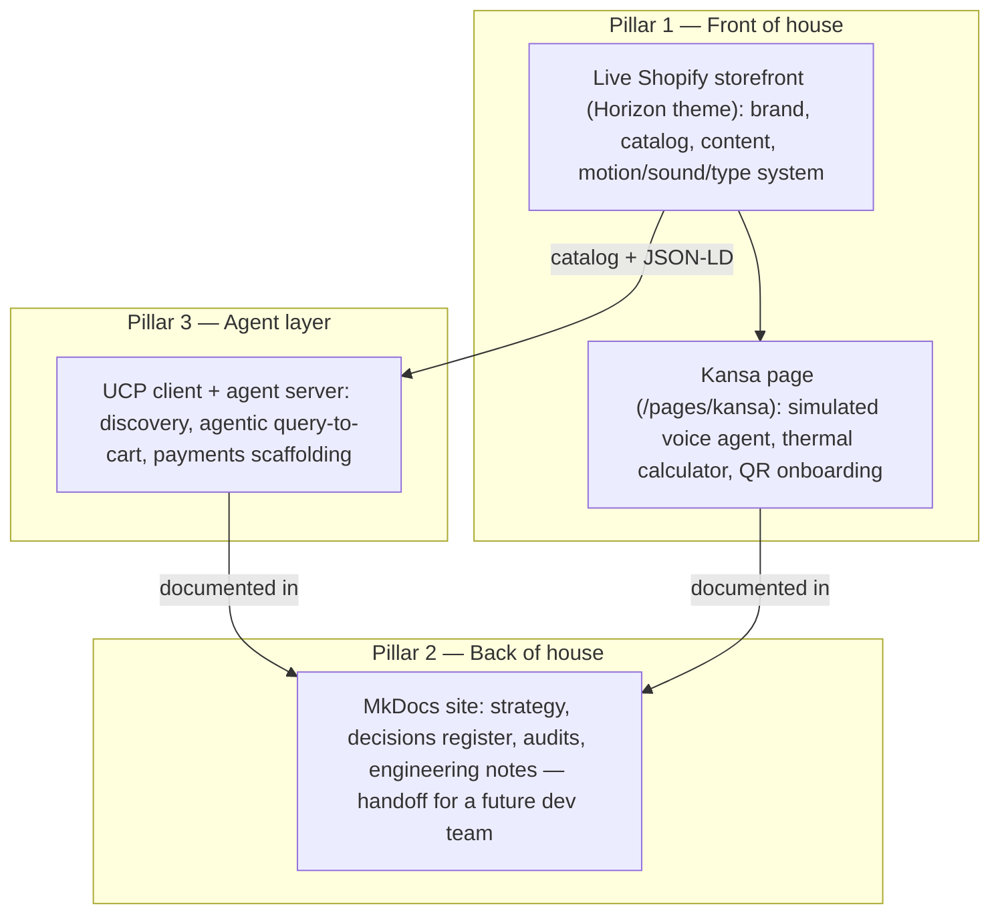
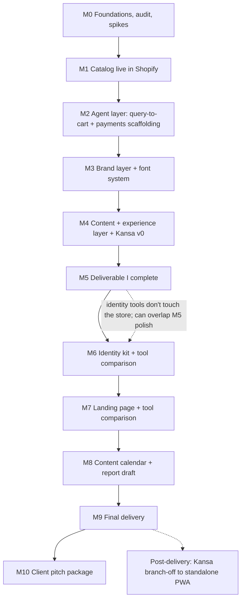

# Engagement roadmap

Internal working roadmap for the Maison Tavo engagement, from current state to client-handoff
pitch package. This is **spec work**: pro bono, lump-sum on completion.

On paper this project answers the engagement brief. In execution it is a **capstone signaling
project for design engineering**: the future of commerce built from first principles — new
onboarding and checkout flows, a machine-readable catalog, a voice-capable companion surface,
and a motion/sound/type system pushed past what templated Shopify stores attempt. The brief's
rubric is the floor, not the ceiling.

Source of truth for scope: the engagement brief (`Maison Tavo - FINAL Full Engagement Brief.md`).
This document operationalizes the brief's Section 13 phase structure into dependency-ordered
milestones, progress markers, and feature workstreams. Where this document and the brief
disagree, the brief wins — edit this file, not the brief.

## The three pillars

The end deliverable is one meta-artifact with three pillars:

- **Front of house** — the polished, copywritten, client-facing storefront. Everything a visitor
  or evaluator sees.
- **Back of house** — this docs site. All strategy, comparisons, audits, and decisions live here,
  written so a future dev team could take over without a meeting.
- **Agent layer** — the UCP/agentic commerce work. Developed under the main storefront for
  development purposes, but an entire pillar by itself in scope and in the pitch.

## Sequencing

Milestones are **task-based, not date-bound** — dependency-ordered todo lists. Run them in one
night or one sprint; the order is what matters, not the calendar. Two external constraints exist
in the background and nothing here manages them for you: Deliverable I must exist before
Deliverable II's tooling work can be assessed, and the full engagement has a fixed due date.
Sequence against those yourself; the dependency order below is the critical path.

## Scope guardrails

Deliverable I/II rubric items are **P0** — they ship first and are never traded away. Signaling
scope (motion, sound, voice, font engineering, agentic extras) is **P1** — layered on top and
designed to degrade gracefully: every P1 feature must leave the store fully functional and
coherent if removed. If a milestone runs long, P1 markers slip in this order: sound design,
then motion polish, then Kansa thermal calculator — never content, never the About page, never
the catalog.

## Milestones and progress markers

Each milestone lists its **progress markers** — the observable "done when" checks. A milestone is
complete only when every marker passes. Markers are written so a second person could verify them
without asking the person who did the work.

### M0 — Foundations, audit, engineering spikes

Groundwork. Cheap, fast, and de-risks everything downstream.

- [x] This roadmap committed and published in the docs site nav.
- [x] **Competitor machine-readability audit** (brief Section 1 open thread) —
      [docs/audit-machine-readability.md](audit-machine-readability.md). All seven competitors
      checked; findings tagged VERIFIED / OBSERVED / HYPOTHESIS. Outcome: D4 rescoped — the
      defensible claim is "first in cookware to make the product spec layer machine-readable"
      (agentic *transactions* are already Shopify platform table stakes; the *spec layer* is
      the open gap).
- [x] Catalog spec schema reviewed against the audit findings — confirmed aligned: the audit's
      key implication (Shopify's native UCP catalog carries no metafields) means
      differentiation comes from enriched JSON-LD `additionalProperty` (M4) plus the agent
      layer reading `packages/catalog` directly (M2) — both already planned; the schema carries
      exactly the fields (material architecture, heat sources, dimensions) the audit found
      missing everywhere else.
- [x] Strategic decisions register opened ([decisions.md](decisions.md)) — category question
      (D1), provenance (D2), and ICP blend (D3) decided; audit position (D4) recorded.
- [x] **Motion spike:** anime.js + Motion (vanilla ESM builds) vendored into `theme/assets/`,
      one demo animation running on the dev theme, `theme:check` clean. No build step — Horizon
      serves theme assets only. Notes: [spikes-m0.md](spikes-m0.md).
- [x] **Sound spike:** Howler.js vendored, one interaction sound behind an explicit opt-in
      toggle, silent by default. Notes: [spikes-m0.md](spikes-m0.md).
- [x] **Font spike:** one self-hosted variable WOFF2 with a unicode-range subset loading via
      `fonts.liquid`, `font-display` and metric-override (`size-adjust`) fallback verified in
      devtools. Notes: [spikes-m0.md](spikes-m0.md).
- [x] **Voice spike:** Web Speech API (SpeechRecognition + SpeechSynthesis) round-trip on the
      password-page spike section (HTTPS preview / secure context). Proves the simulated-agent
      path before it is designed around. Notes: [spikes-m0.md](spikes-m0.md).

### M1 — Catalog live in Shopify

The catalog is the shared dependency: the agent layer, the storefront, and the Kansa page all
read from it. Built once, carried through every later phase (brief Section 13).

Products are DRAFT/unpublished; push via `bun scripts/push-catalog.ts --apply`.

**Data refresh:** edit `data/*.csv` → `bun run --cwd packages/catalog seed:build` →
`bun scripts/push-catalog.ts` (dry-run) → `bun scripts/push-catalog.ts --apply`.
Re-pushes update existing drafts (title, description, tags, SEO, `specs.*` metafields,
SKU/price/weight) and sync unpublished lineup collections (`terre-clay`, `forge-hybrid`,
`forge-terre`, `kuro-strip`). Never publishes; never deletes unrelated products.

- [x] `packages/catalog` workspace created: zod `ProductSpec` schema covering alloy
      composition / layer stack, dimensions, weight, heat-source compatibility
      (induction / gas / electric), thermal conductivity, GTIN, care and seasoning rules,
      warranty tier.
- [x] Seed data for 11 concept SKUs (Terre Clay, Forge Hybrid, Forge × Terre, Kuro Strip)
      built from `data/maison-tavo-new-listings-*.csv`, versioned in the repo as data (not
      typed into admin by hand).
- [x] Layer stack stated in data as a flagged fabrication assumption (D5), never as a precise
      marketing claim.
- [x] Product metafield definitions created on `maison-tavo.myshopify.com` via Shopify CLI /
      Admin GraphQL (`specs.lineup`, `specs.claim_status`, `specs.material_architecture`,
      `specs.food_contact_strategy`, `specs.fabrication_route`, `specs.care_hypothesis`,
      `specs.heat_sources`, `specs.agent_intents`, `specs.negative_constraints`,
      `specs.concept_thesis`).
- [x] All 11 products created/refreshed in admin as DRAFT with price and metafield values
      from the seed data by script — reproducible, re-runnable; lineup collections assigned.

### M2 — Agent layer: query-to-cart + payments scaffolding — Phase 0 complete

The brief's load-bearing hypothesis, proven end to end on the real store, plus the scaffolding
that makes it a pillar rather than a demo.

- [ ] Constraint evaluator in `apps/agents/src/shopper.ts`: budget, piece count, heat source,
      and use-case constraints in → SKU selection out, evaluated against the spec schema.
- [ ] `POST /agents/shopper/query` route in `apps/agents/src/server.ts` returning a validated
      cart payload in one call.
- [ ] Checkout routes (`create` / `get` / `update` / `complete`) exposed, wiring the
      already-implemented `UcpClient` checkout methods.
- [ ] **Agentic payments scaffolding:** payment-handler entries typed in the agent profile
      (`apps/agents/src/profile.ts`), `complete_checkout` payload schema defined, escalation /
      `continue_url` flow documented — the shape of agentic settlement, ready for a real
      handler later.
- [ ] **Discovery fleshed out:** `/.well-known/ucp` profile documented, agent-facing
      machine-readable copy plan written (what an agent can learn about each product, policy,
      and warranty without a human), JSON-LD parity between storefront and agent surface.
- [ ] Proof query passes live: *"assemble a 5-piece set under $1,800 suitable for induction
      searing and clay slow-cooking"* → validated cart.
- [ ] `bun test packages apps` green, including new constraint-evaluator and route tests;
      `bun run typecheck` clean.

### M3 — Brand layer + font system

Token-level branding plus the typography engineering. Follows the `theme/AGENTS.md` workflow:
settings and CSS custom properties, never hardcoded one-offs.

- [x] Five palette colors (Raw Copper, Aged Bronze, Obsidian Charcoal, Cast Clay, Damascus
      Silver) added to `theme/config/settings_schema.json` and wired in
      `theme/snippets/color-palette.liquid`.
- [x] Typography pairing set: high-contrast luxury serif for headings, industrial mono for
      metallurgical specs, via font settings.
- [x] **Font system (P1 showcase):** multiple self-hosted variable WOFF2 faces in
      `theme/assets/`, unicode-range subsetting (Latin core + extended), preload of the
      critical subset, `font-display` strategy, metric-overridden fallback stack
      (`size-adjust` / `ascent-override`) for zero-CLS swap — all in
      `theme/snippets/fonts.liquid`, pushing WOFF2 as far as it goes: one variable file per
      family, not one file per weight.
- [x] `theme/STYLEGUIDE.md` promoted from placeholder inventory to the approved brand mapping
      (its own stated workflow).
- [x] `bun run theme:check` clean; verified on the unpublished development theme only.

### M4 — Content + experience layer + Kansa v0

Storefront content (P0) and the experience engineering (P1) land together, in that order.

- [x] Homepage hero and section copy replaced (no stock "Browse our latest products" remains).
- [x] `templates/page.about.json` created; About page argues the Section 1 diagnostic directly
      with claims visibly tagged VERIFIED / OBSERVED / HYPOTHESIS (scored criterion, 25 pts).
- [x] PDP spec table block rendering product metafields in the mono typeface.
- [x] Product JSON-LD enriched beyond stock `structured_data`: `additionalProperty` for spec
      fields, GTIN — the storefront half of the machine-readability claim.
- [ ] Collections and navigation hierarchy built (Skillets / Tagines / Knives / Sets).
- [ ] **Motion pass (P1):** vendored anime.js / Motion microanimations — hero reveal, spec-table
      stagger, cart feedback — respecting `prefers-reduced-motion`, no layout shift.
      *(Hero reveal from M0 + spec-table CSS stagger shipped; cart-feedback motion still open.)*
- [ ] **Sound design v0 (P1):** Howler soundscape — interaction feedback on add-to-cart and
      configurator actions — opt-in toggle, silent by default, persisted preference (D10).
- [ ] **Kansa page v0 (P1):** `/pages/kansa` template in the theme with the simulated voice
      agent (Web Speech API, scripted intents: seasoning walkthrough, sear-temperature answer,
      voice-to-cart stub — D9), thermal calculator v0 reading catalog spec data, and Zustand
      (`zustand/vanilla` + `persist`) for session state in localStorage. Architected so a real
      backend (OpenAI Realtime) can replace the scripted intents without a rewrite.
- [ ] **QR onboarding flow:** URL constructor scheme documented (`/pages/kansa?piece=<handle>`)
      — the URL stamped into each pan's QR code lands on Kansa pre-loaded with that piece's
      care data. This is the first-principles onboarding flow: object → scan → software.

### M5 — Deliverable I complete

- [ ] Development store polished and coherent end to end (scored criterion: Overall Execution).
- [ ] Video walkthrough of the brand recorded.
- [ ] 1,500-word strategy memo written — argues the decided positions properly: the MECE
      category stack (D1), the three-tradition synthesis as design story (D2), and the blended
      technologist-curator persona read at two depths (D3).
- [ ] Buffer held after completion for polish, re-records, and any slipped P1 markers only.

### M6 — Identity kit + tool comparison

- [ ] Logo, palette, and voice guide produced via Pomelli **and** one of Canva / Adobe Express.
- [ ] Documented comparison (what changed, why, which leads) written for Report Section 3 —
      the two-tool comparison discipline is the load-bearing requirement, not the tool names.

### M7 — Landing page + tool comparison

- [ ] Marketing landing page built via Stitch **and** one of Framer AI / Canva.
- [ ] Process comparison documented with patterns, logic, prompts, and screenshots (Report §4).
- [ ] 60–90s screen-recorded walkthrough captured.

### M8 — Content calendar + report draft

- [ ] Concept-level IG + TikTok content calendar, platform-differentiated: TikTok carries the
      technologist's spec/comparison content, Instagram carries the curator's
      provenance/staging content, the trade register stays on-site (D3).
- [ ] 1,500-word report drafted across all six required sections, including where the team
      departed from brief Sections 5–8 and why (scored under Strategic Reasoning).

### M9 — Final delivery

- [ ] Report finalized.
- [ ] 10-minute recorded video + 3-minute live pitch deck with embedded webpage walkthrough.
- [ ] Pitch rehearsed against the deck at least twice before submission.

### M10 — Client handoff package

The end state: everything a potential client needs to evaluate the full-scope engagement,
assembled while Deliverable II artifacts are fresh. Packaged by pillar.

- [ ] Full-scope proposal document: the brief's Phase 3 ceiling (Surface A, full Surface B,
      Kansa voice with a real backend, standalone Kansa PWA, physical asset system) framed as
      the pitched engagement, with the delivered Phase 0–2 work cited as working proof, not
      mockups.
- [ ] Demo script for the live store + agentic query flow + Kansa voice (the 60-second version
      and the 10-minute version).
- [ ] Back-of-house docs brought current: the docs site covers the theme, the Kansa page, and
      the agent layer — written for a future dev team taking over without a meeting.
- [ ] Repo hygiene pass: README accurate, no dead scaffolding (Hydrogen `guides/` tutorials,
      `MockShopNotice`), license/notice intact.

### Post-delivery — Kansa branch-off

- [ ] Kansa extracted from the theme page into a standalone PWA (own workspace, Vite + React +
      Motion + Zustand), hosted on GitHub Pages, consuming the same `packages/catalog` data and
      Storefront API. The in-theme v0 was deliberately built to make this extraction cheap (D7).

## Feature workstreams

Milestones are sequence; workstreams are the engineering threads that cut across them. Each
lists its file-level targets in this repo.

### WS1 — Catalog and data (M1, feeds everything)

- `packages/catalog/` (new): `src/schema.ts` (zod `ProductSpec`), `src/seed.ts` (11 SKUs from
  `data/*.csv` via `seed:build`), `test/schema.test.ts`.
- `scripts/push-catalog.ts`: idempotent Admin GraphQL push of metafield definitions +
  products from seed data; `--apply` creates missing drafts and refreshes existing ones;
  syncs unpublished lineup collections.
- Shopify admin: metafield definitions, DRAFT products, lineup collections.

### WS2 — Agent layer / Surface B (M2, Phase 3 ceiling)

- `apps/agents/src/shopper.ts`: constraint evaluator.
- `apps/agents/src/server.ts`: `/agents/shopper/query` + checkout routes.
- `apps/agents/src/profile.ts`: payment-handler scaffolding, capability advertising.
- `packages/ucp/src/schemas.ts`: extend `Product` toward spec fields as the store's UCP surface
  allows; keep `z.looseObject` passthrough deliberate; type the `complete_checkout` payload.
- `packages/ucp/test/`, `apps/agents/test/` (new): evaluator, routes, checkout lifecycle.
- Phase 3 extension (pitch scope): autonomous policy validation, B2B tax-exemption logic,
  agentic cart synthesis at full UCP depth.

### WS3 — Brand layer and font system (M3)

- `theme/config/settings_schema.json`, `theme/snippets/color-palette.liquid`,
  `theme/snippets/theme-styles-variables.liquid`, `theme/assets/base.css`,
  `theme/STYLEGUIDE.md`.
- `theme/snippets/fonts.liquid`: self-hosted variable WOFF2, unicode-range subsets, preload,
  metric-overridden fallbacks.

### WS4 — Storefront content and structure (M4)

- `theme/templates/index.json`, `theme/templates/page.about.json` (new),
  `theme/templates/product.json`, new spec-table block in `theme/blocks/`, JSON-LD snippet in
  `theme/snippets/`, header/nav sections, `theme/locales/en.default.json` copy.

### WS5 — Experience engineering (M0 spikes, M4 build)

The design-engineering showcase layer. All of it vendored ESM in `theme/assets/` (Horizon has
no build step; `assets/package.json` stays `{ "type": "module" }`).

- **Motion:** anime.js + Motion (vanilla builds) for microanimations — reveals, staggers, cart
  and configurator feedback. `prefers-reduced-motion` respected everywhere.
- **Sound:** Howler.js soundscape — interaction feedback, opt-in and silent by default,
  persisted preference.
- **State:** Zustand (`zustand/vanilla` + `persist` middleware) for session state and
  localStorage persistence on the Kansa page and interactive surfaces.
- **Voice:** Web Speech API simulated Kansa agent — scripted intents behind an interface a real
  backend can later replace.
- **First-principles flows:** QR onboarding (object → scan → software, via the URL constructor)
  and the agentic checkout path (WS2) are the two new-flow signaling pieces.

### WS6 — Kansa surface (M4 in-theme, post-delivery standalone)

- `theme/templates/page.kansa.json` (new) + `theme/sections/kansa-app.liquid` (new) +
  `theme/assets/kansa-*.js`: the integrated v0.
- URL constructor: `/pages/kansa?piece=<product-handle>` — QR codes stamped on each piece
  encode these URLs.
- Post-delivery: extract to standalone PWA workspace on GitHub Pages.

### WS7 — Marketing layer (M6–M8, mostly external tools)

- Pomelli + Canva/Adobe Express (identity), Stitch + Framer AI/Canva (landing), IG/TikTok
  concept calendars. Repo touchpoint: comparison write-ups and rationale in `docs/`.

### WS8 — Deliverable artifacts and handoff (M5, M8–M10)

- Strategy memo (1,500 words), Deliverable II report (1,500 words, six sections), walkthrough
  videos, pitch deck, full-scope proposal, demo scripts. Drafted in `docs/` so they are
  versioned with the work they describe.

## Technology choices

| Concern | Choice | Where | Constraint |
| --- | --- | --- | --- |
| Microanimation | anime.js + Motion (vanilla ESM) | `theme/assets/` | Vendored, no build step; reduced-motion aware |
| React animation (later) | Motion (`motion/react`) | standalone Kansa PWA | Post-delivery branch-off only |
| Sound design | Howler.js | `theme/assets/` | Opt-in, silent default, persisted preference |
| Session state | Zustand `vanilla` + `persist` | Kansa page, interactive surfaces | localStorage; no server state |
| Voice (Phase 1) | Web Speech API, scripted intents | Kansa page | Requires secure context — use `dev:theme:https` locally |
| Voice (Phase 3 pitch) | OpenAI Realtime API node | agent layer | Replaces scripted intents behind the same interface |
| Fonts | Self-hosted variable WOFF2 + subsets | `theme/assets/`, `fonts.liquid` | One variable file per family; metric-overridden fallback |
| Catalog data | zod schema + versioned seed | `packages/catalog` | Single source for store, agents, and Kansa |
| Agent protocol | Shopify UCP `2026-08-25` over MCP JSON-RPC | `packages/ucp`, `apps/agents` | Already pinned; extend, don't fork |

## Strategic decisions register

All strategic questions now have decided positions — see [decisions.md](decisions.md) for full
rationale:

| Question | Brief ref | Status |
| --- | --- | --- |
| Category: cookware / intelligent cookware / agent-native commerce | Section 10 | **D1: all three, MECE stack** — object, software layer, protocol |
| Provenance: credible synthesis vs. borrowed prestige | Section 8 | **D2: deliberate synthesis** — three-place texture is the design story |
| Primary ICP | Section 3 | **D3: ICP 1 + ICP 2 blend** for the hospitality chef persona; nothing deprioritized |
| Is the "machine-readable" gap real across competitors | Section 1 | **D4: first-mover position taken** — M0 audit substantiates before copy |
| Exact layer stack — fabrication partner before copy claims | Section 4 | D5: flagged assumption until a fabricator specifies it |
| Kansa thermal calculator timing | Section 12 | **D6: v0 ships in M4** |

## Working agreements

- Live theme is never touched automatically: development theme only until an explicit production
  push is approved (see `theme/AGENTS.md`).
- Theme dev loop is push-based (`shopify theme push --development --nodelete` + preview URL)
  until the CLI's `theme dev` color_palette validation bug is fixed upstream — see
  [development.md](development.md). Do not change valid `color_palette` defaults to appease the
  dev server.
- React Router imports only in `hydrogen/` — never `react-router-dom`, never `@remix-run/*`.
- Evidence-tier discipline: VERIFIED / OBSERVED / HYPOTHESIS tags survive into customer-facing
  copy on the About page; nothing unaudited gets quoted as fact.
- Scope discipline (brief Section 9): anything cut from Sections 5–8 is cut explicitly, on the
  record, in the decisions register — not quietly under-built. The P0/P1 guardrails above are
  how this roadmap honors that.
- This roadmap is a living file: when a marker is checked, the check is committed; when scope
  changes, the milestone is edited with a one-line reason.
